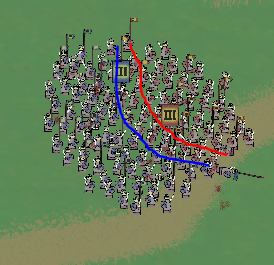
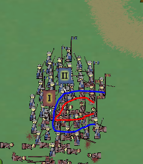

# Trailblazers
 A 2-Player Fast Paced Action Real Time Strategy Game. 

A project from right before starting college. I think it demonstrates my experience with Unity through work with the Animation System, The Physics System, Particle Systems, UI, and Unity's various libraries. I hope you enjoy it! It takes some practice to get a competitive game going.

## Controls

### Player 1

 W,A,S,D - To move the selected cohort leader. The cohort troops will try their best to follow the cohort leader.

 Left Shift - Switch to the next cohort leader, 1 -> 2, 2 -> 3, or 3 -> 1

 Tab - Use the cohort's special ability.

### Player 2

 Arrows - To move the selected cohort leader. The cohort troops will try their best to follow the cohort leader.

 Ctrl - Switch to the next cohort leader, 1 -> 2, 2 -> 3, or 3 -> 1

 Right Shift - Use the cohort's special ability.

### Cheats

4 - Move Camera to the center of the map

6 - Move Camera to view the entire map

7 - Return Camera to focus on leaders (The default camera state)

9 - Advance the stage left - Automatic Blue Subround Victory (Can be game breaking)

0 - Advance the stage right - Automatic Red Subround Victory (Can be game breaking)

## Game Overview

### Game Flow

This game is a tug of war between the two players. The objective is to advance the stage towards the enemies direction by winning various subrounds. The stage starts in the center of the map and can be advance 2 stages in either direction before a player's main castle is vulnerable. If a player's main castle is seized by the other player, that player loses the game.

### Subrounds

Here are all the possible subrounds, the current subround will be denoted by the top-center text

#### Skirmish

The first subround played in every game. Towers are not relevant in this round. There are 60 seconds for each player to inflict as many casualties on their enemy as possible. The player who inflicts the most casualties wins the subround and advances the stage towards the enemies castle.

#### Advancing

An interim subround, players will have no control of their troops. The cohorts belonging to the player who won the last round will automatically advance to the next stage. They will receive no reinforcements and will have to move forward with reduced numbers. The cohorts belonging to the player who lost the last round will disband and that player will be given a fully reinforced set of new cohorts. These cohorts will have randomized types. (Archers, Spearmen, or Infrantry)

#### Assault

This is the main subround that Players will be fighting in throughout the majority of the game. The player who won the last subround will advance into the next stage and will have to seize 3 towers from the defending player. They have 1 minute and 15 seconds to do so. If the time elapses without the towers being taken, the defending player will win the subround and advance. Tower ownership is denoted by small colored flags on the top of the towers. The towers must be taken sequentially (closest to farthest) by the assaulting player, a tower can only be taken if the flag at its top is waving. Once a tower has been taken by the attacking player it can not be retaken. To capture a tower a player's troops must make a local majority at the base of the tower, once a majority has been formed the tower will be instantly taken and the next tower will become avaliable for capture. (Players should attempt to maintain majorities on towers that aren't yet avaliable for capture to instantly perform multiple captures in a row) Once all three towers have been taken, the assaulting player wins the subround and advances the stage. At the final stage on the left or the right the final tower will be replaced by a castle, this acts in exactly the same way as the towers except once a player's castle is taken the game ends and they lose.

### Troops and Cohorts

#### Leaders

Each player controls 3 leaders at all times. These leaders can be identified by their massive size versus standard troops and by the large banners they carry around with roman numerals on them. Leaders cannot be killed and deal no damage. The leaders all have complete freedom of movement, they can go through friendly and enemy troops. Players can only control one leader at a time switching between them by using their leader switch button. When a leader is selected his roman numerals will be highlighted and his UI banner on the side of the screen will also highlight. Each leader is associated with a cohort of troops who will do their best to make a direct path to the leader, i.e. if you position the leader behind an enemy cohort, the troops will attempt to go straight through the enemy and often will end up accidentally enveloping them. The leader has a faster speed than their troops, this allows you to position him far away from his cohort and switch to another leader while his troops catch up. Think of leaders as movement markers for their troops.

#### The intricacies of combat

Battle is often one-sided and quick. The shape of your cohorts when engaged in melee will determine who takes almost all of the casualties. Troops will take casualties when their battle line is concave and conversely troops will deal damage when their battle line is convex.

In the above situation, the red troops are in a pretty poor situation and are taking casualties fast. Notice the shape of the battle line. The blue leader brought his troops to the side and wrapped around the red troops. Blue is taking almost no casualties in this battle. The next step for red is to run or reposition his troops to form a more favorable battle line.

In the above situation, the red troops are in a catastrophic situation. They have been encircled and due to the long line formed by blue compared to the shorter line formed by red they are taking casualties at an alarming rate. They have been almost instantly destroyed. I almost couldn't screenshot fast enough.

#### Troop Types

1. Infrantry

    Recognizable due to their shields, swords, and gray uniforms. Act as normal troops in melee. If the player activates their special ability with a cohort of infrantry selected, the infrantry will raise their shields for 2.5 seconds. During this time they cannot be killed by arrows. It is imperative you time this correctly.

2. Spearmen

    Recognizable due to their spears, bucket hats, and checkered uniforms. Act as normal troops in melee. If the player activates their special ability with a cohort of spearmen selected, the spearmen will cease attempting to reach their leader and let other troops push them around with ease for 5 seconds. This is useful when an enemy formation smashes into a unit of spearmen, this ability will let the center of the spearmen formation give way to the enemy and create a favorable battle line early on.

3. Archers

    Recognizable due to their bows and brown uniforms. These troops deal no damage in melee, convex or concave. Still need to be damaged through a concave battle line, so positioning can still be useful for survivability. If the player activates their special ability with a cohort of archers selected, the archers will knock their bows and a red targeting range will appear. While knocked the archers stop moving and the leader also freezes. The player can no longer control the leader instead the player gains control of a targeting reticle that can be moved with the traditional movement keys. When the special ability button is pressed a second time the troops will release a volley towards the targeting reticle. If the target is not valid, the targeting reticle will be gray and the archers will instead simply deknock their bows. Volleys of arrows have devastating affect provided they land true. They are able to destroy entire cohorts in one fell swoop. They can kill both your enemies troops and your own troops, so be careful!

## Some Final Notes

    You can knock a cohort of archers, postioning their targeting reticle, and then select another leader. The archers will stay knocked and targeted for the next time you switch to them. The targeting reticle will remain visible while you control the other leaders. This acts as a beautiful deterrent from key positions.

    This is a game about multitasking at its root. Make sure you keep all of your troops doing something and you'll be able to overwhelm your opponent. When they fail to react to one of your movements, it effectively guarantees a victory in that area. Good players are constantly switching between their leaders.

    When defending, the first thing you should do is position troops at the base of the towers. Always have the active tower secure and the one behind it secure. Otherwise the enemy can just walk past you and seize the towers.

    Enjoy!
